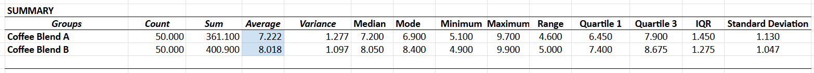
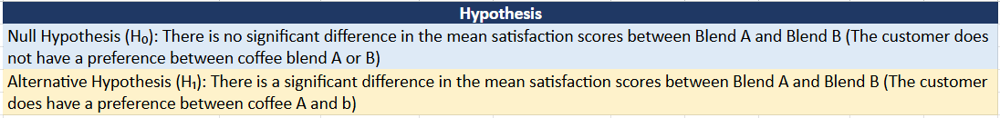

# ☕ Consumer Preference Statistical Audit (A/B Testing)

## 🎯 The Goal & Business ROI
A retail chain required a data-validated decision on which of two new product variations (Blend A or Blend B) to launch nationally. Relying on subjective "average scores" alone was deemed high-risk due to potential outliers and data dispersion.

*   **The Objective:** Conduct a rigorous statistical audit to identify the "Winning Blend" and measure the consistency of consumer satisfaction.
*   **The ROI:** Eliminated product-launch guesswork by providing **mathematical proof** of preference, ensuring marketing capital is allocated only to the most stable, high-performing product.

---

## 💡 Strategic Recommendations & ROI Roadmap
*Summary: Moving the product strategy from "Subjective Opinion" to "Mathematical Certainty."*

<b>▶ Click to expand: Data-Validated Business Solutions</b>

### Solution 1: Market Prioritisation (The Winning Bet)
**The Data:** Blend B achieved a superior average (8.01) and showed significantly **tighter consistency** (lower Standard Deviation) than Blend A.
*   **The Action:** Focus the national rollout entirely on **Blend B**.
*   **The ROI:** Higher customer retention. By choosing the "stable" blend, the business reduces the risk of negative reviews and ensures a predictable customer experience.

### Solution 2: Operational Efficiency (Supply Chain Simplification)
**The Data:** Probability modelling (**P=0.9**) proves that 90% of the target market is satisfied by these two options alone.
*   **The Action:** Decommission Blend A and reallocate its production/marketing budget to Blend B.
*   **The ROI:** Avoids **inventory clutter**. Saves costs on packaging, storage, and logistics by focusing on a single high-margin "Winner."

---

## 📊 Performance & Volatility Analysis
To ensure the results were not the result of random chance, I established a rigorous Hypothesis framework and conducted a full descriptive audit.

*(Above: The formulated Hypothesis logic used to maintain an unbiased baseline.)*

### The Statistical Translation (Why Blend B Wins)
While the raw output (top of page) contains the full statistical engine, the business translation is as follows:

| Metric | Coffee Blend A | Coffee Blend B | The Business Translation |
| :--- | :--- | :--- | :--- |
| **Average (Mean)** | 7.22 | **8.01** | Blend B scores ~11% higher overall |
| **Median** | 7.20 | **8.05** | Blend B's true center is higher |
| **Interquartile Range (IQR)**| 1.45 | **1.27** | *Blend B has tighter consistency* |
| **Standard Deviation** | 1.13 | **1.04** | *Blend B has lower volatility (lower risk)* |

*   **Central Tendency:** Prioritised the **Median** over the Mean to ensure the audit was resistant to extreme outliers.
*   **Volatility Analysis:** Utilised **Standard Deviation** and **Interquartile Range (IQR)** to identify the "Risk Profile" of each blend. Lower dispersion makes Blend B the mathematically "safer" bet.

---

## 🛠️ The Technical Engine (Excel)
While many use Excel for simple lists, I utilised the **Data Analysis Toolpak** to conduct a professional-grade quantitative audit.

*   **Core Methods:** Two-Sample T-Tests, Probability Rules (Independent/Mutually Exclusive), and Normal Distribution modelling.
*   **Auditability:** Implemented strict spreadsheet architecture, separating raw data from calculation engines to ensure full financial compliance and traceability.

---

## 🏆 Core Competencies Demonstrated
*   **Statistical Fluency:** Ability to move beyond "Averages" to identify true trends using Standard Deviation and Variance.
*   **Risk Mitigation:** Used volatility metrics to protect the business from "unstable" product choices—a direct crossover from my quantitative trading background.
*   **Commercial Logic:** Proven ability to translate abstract variables ($p < 0.05$) and probability into actionable **Inventory and Marketing decisions**.

---

## ⚙️ Setup & Reproduction
1.  Download the `Statistical_Analysis_Katen.xlsx` file.
2.  Review the **Summary Statistics** tab to inspect the formulaic links, raw Toolpak outputs, and hypothesis logic.
3.  *Note: All data has been anonymised to maintain privacy standards.*

---
*This project was completed as part of the Professional Certificate in Data Analytics & AI (Code Institute).*
