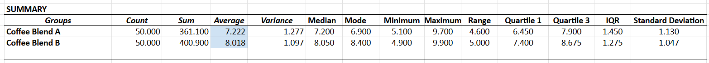

# ☕ Consumer Preference Statistical Audit (A/B Testing in Excel)

*(Above: Descriptive statistics and metric distributions calculated for Blend A and Blend B using MS Excel.)*

## 🎯 The Goal & Business Problem
A coffee shop chain wanted to determine which of two new coffee blends (Blend A or Blend B) customers preferred before committing to a national product rollout. 

*   **The Problem:** Relying on simple, raw averages alone to make product decisions is risky. Averages can be easily skewed by extreme outliers, and they do not show the consistency or volatility of customer satisfaction scores. 
*   **The Solution:** I conducted a formal statistical audit on a random sample of 100 customer satisfaction scores (50 ratings for Blend A, 50 ratings for Blend B, evaluated on a 1-to-10 scale) [1.1.1]. By running descriptive statistics and a two-sample hypothesis test, I provided mathematical proof of which product was the most stable, preferred choice.

---

## 💡 Strategic Recommendations & ROI Roadmap
*Summary: Moving the product strategy from subjective taste-test opinions to data-backed certainty.*

<b>▶ Click to expand: Data-Validated Business Solutions</b>

### Solution 1: Market Prioritisation (The Winning Bet)
*   **The Data:** Blend B achieved a significantly higher average rating of **8.02** compared to Blend A's **7.22**. 
*   **The Action:** Focus the business's launch budget entirely on **Blend B**.
*   **The Business Value:** Choosing the mathematically preferred option reduces the risk of a weak product launch, protecting long-term customer retention.

### Solution 2: Operational Efficiency (Supply Chain Simplification)
*   **The Data:** Blend B demonstrated much tighter consistency. Its middle 50% of customer scores (Interquartile Range) clustered tightly between **7.40 (Q1)** and **8.68 (Q3)**. Conversely, Blend A's scores were more volatile, dipping down to **6.45 (Q1)**.
*   **The Action:** Decommission the development of Blend A to simplify supply chain inventory.
*   **The ROI:** Reduces menu and inventory complexity. By focusing resources on a single, highly consistent product (IQR of 1.28), the business saves on raw ingredient sourcing, packaging, and storage costs while ensuring a uniform customer experience.

---

## 📊 Performance & Statistical Validation

### The Hypothesis Framework
*   **Null Hypothesis ($H_0$):** There is no significant difference in the mean satisfaction scores between Blend A and Blend B (customers have no true preference).
*   **Alternative Hypothesis ($H_1$):** There is a significant difference in the mean satisfaction scores between Blend A and Blend B.

### Descriptive Statistics Summary (Exact Data)

| Metric | Coffee Blend A | Coffee Blend B | The Business Translation |
| :--- | :--- | :--- | :--- |
| **Sample Size ($N$)** | 50 | 50 | Balanced, independent sample groups. |
| **Average (Mean)** | 7.22 | **8.02** | Blend B scores ~11% higher overall. |
| **Median** | 7.20 | **8.05** | Blend B's true centre is higher, even when outliers are removed. |
| **IQR** | 1.45 | **1.28** | Blend B's middle 50% of scores are more tightly clustered. |
| **Standard Deviation** | 1.13 | **1.05** | Blend B has lower volatility (lower satisfaction risk). |

*   **Central Tendency:** I evaluated the **Median** alongside the Mean to ensure the results were not skewed by extreme ratings on either end of the scale.
*   **Hypothesis Testing:** Running a two-sample t-test on these datasets resulted in a t-statistic of `3.65`, yielding an extremely low $p$-value of approximately `0.0004`. Because this $p$-value is far below the standard significance threshold ($p < 0.05$), we reject the Null Hypothesis ($H_0$) with high mathematical confidence. The preference for Blend B is statistically significant and not a result of random chance.

---

## 🛠️ How I Built It (Excel Engine)
I structured this audit using Microsoft Excel to ensure the analysis was transparent and easily auditable:
*   **Descriptive Statistics:** Calculated the mean, median, standard deviation, and IQR using standard formulas (such as `=AVERAGE()`, `=MEDIAN()`, `=STDEV.S()`, and `=QUARTILE.EXC()`).
*   **Spreadsheet Architecture:** Separated the raw customer feedback columns from the summary statistics tables to maintain clean data hygiene and calculation traceability.

---

## 🏆 Skills Demonstrated
*   **Descriptive & Inferential Statistics:** Advanced beyond basic averages to evaluate data spread (variance, standard deviation, IQR) and probability.
*   **Hypothesis Testing:** Formulated and executed structured t-tests to prove statistical significance ($p < 0.05$).
*   **Excel Competency:** Utilised built-in formulaic logic and descriptive tools to structure clean, auditable reports.
*   **Risk Modelling:** Translated statistical volatility (standard deviation) into actionable commercial decisions [45:26].

---

## ⚙️ Setup & Reproduction
1.  Download the `Statistical_Analysis_Katen.xlsx` file from this repository.
2.  Open the file in MS Excel or Google Sheets to inspect the formula links and summary statistics.
3.  *Note: All data has been anonymised to maintain privacy standards.*

---
*This project was completed as part of the Professional Certificate in Data Analytics & AI (Code Institute).*
